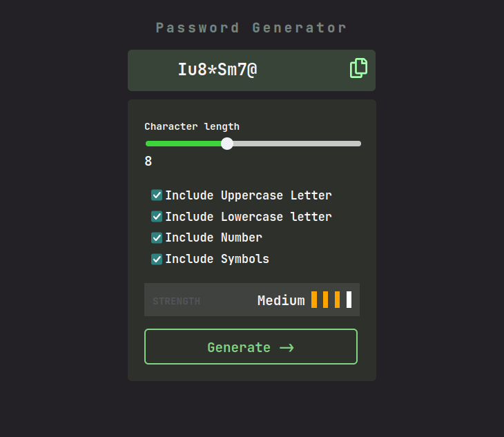

# Frontend Mentor - Password-Generator-app

This is a solution to the [Password-generator app challenge on Frontend Mentor](https://www.frontendmentor.io/challenges/tip-calculator-app-ugJNGbJUX). Frontend Mentor challenges help you improve your coding skills by building realistic projects.

## Table of contents

- [Overview](#overview)
- [The challenge](#the-challenge)
- [Screenshot](#screenshot)
- [Links](#links)
- [Built with](#built-with)
- [What I learned](#what-i-learned)

## Overview
In  this project we create password generator app .it gives a random password according to your customize and there are four  level in it .copy option also include.
### The challenge

Users should be able to:
- you should open this project in live site for better experience
- View the optimal layout for the app depending on their device's screen size
- See hover states for all interactive elements on the page

### Screenshot

### Links

- Solution URL: (https://github.com/tushar-Ruhela/Password-generator-app.git)
- Live Site URL: (https://password-generator-page.netlify.app)

### Built with

- Semantic HTML5 markup
- CSS custom properties
- Flexbox
- javascript
- desktop-first workflow

### What I learned
In this project i learn new thing like  how customize range slider through javascript,add option for copy .
function updateSliderLength() {
    const value = slider.value;
    rangeValue.textContent = value;
    const min = slider.min;
    const max = slider.max;
    const percentage = ((value - min) / (max - min)) * 100;
    slider.style.background = `linear-gradient(to right, rgb(60, 211, 60) ${percentage}%, rgb(200, 200, 200) ${percentage}%)`;
}

    navigator.clipboard.writeText(generatedPassword).then(() => {
        alert("Password copied to clipboard!");
    }).catch(err => {
        console.error("Could not copy text: ", err);
    });

## Author

- Website - [Add your name here](https://www.your-site.com)
- Frontend Mentor - [@yourusername](https://www.frontendmentor.io/profile/yourusername)
- Twitter - [@yourusername](https://www.twitter.com/yourusername)

